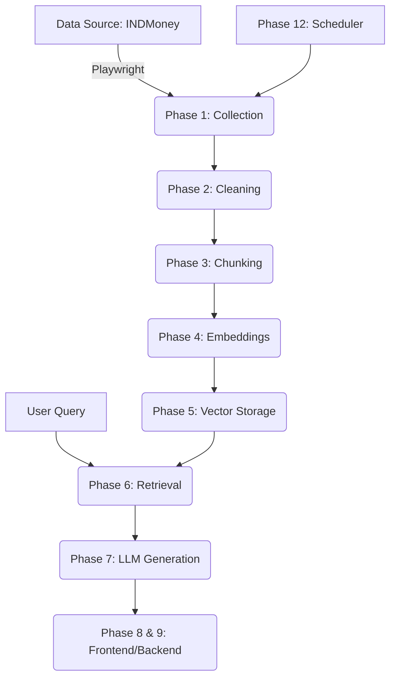

# INDMoney Mutual Fund FAQ Chatbot - System Architecture

This document outlines the phase-wise system architecture for the RAG-based Mutual Fund FAQ chatbot using INDMoney's public data.

## Phase-Wise System Design

---

### Implementation Phases

#### Phase 1: Data Collection
*   **Objective**: Automate the collection of fund-specific data from INDMoney’s public pages.
*   **Components**: Scraper module, URL list manager.
*   **Tools**: `Playwright` (for handling dynamic JS content).
*   **Expected Outputs**: Raw JSON/HTML dumps of fund pages.
*   **Testing**: Run scraper on a subset of funds; verify key metrics exist in raw output.

#### Phase 2: Data Cleaning
*   **Objective**: Extract searchable facts and remove noise (ads, headers, footers).
*   **Components**: Cleaning script, PII filter.
*   **Tools**: `BeautifulSoup`, `Regex`.
*   **Expected Outputs**: Structured, text-only data for each fund.
*   **Testing**: Manual inspection of cleaned output for residual HTML or irrelevant text.

#### Phase 3: Chunking
*   **Objective**: Break long documents into semantic, manageable pieces for the LLM.
*   **Components**: Recursive Character Splitter.
*   **Tools**: `LangChain` or `LlamaIndex` utilities.
*   **Expected Outputs**: Overlapping text chunks with metadata (source URL).
*   **Testing**: Ensure chunks (e.g., 500-1000 tokens) don't split critical numeric values.

#### Phase 4: Embeddings
*   **Objective**: Convert text chunks into vector representations for semantic search.
*   **Components**: Embedding model interface.
*   **Tools**: `text-embedding-004` (Google Gemini Embeddings).
*   **Expected Outputs**: Vector arrays associated with each chunk.
*   **Testing**: Cosine similarity check between a query and its expected context chunk.

#### Phase 5: Vector Storage
*   **Objective**: Persistent storage and efficient similarity indexing of embeddings.
*   **Components**: Vector database table.
*   **Tools**: `PostgreSQL` with `pgvector` (via Neon or Supabase).
*   **Expected Outputs**: A live database table indexed for fast vector search.
*   **Testing**: Execute a sample vector search query; measure performance (<200ms).

#### Phase 6: Retrieval
*   **Objective**: Retrieve top-k contextually relevant pieces of information for the query.
*   **Components**: Semantic search retriever, Metadata filter.
*   **Tools**: `pgvector` HNSW/IVFFlat indexing.
*   **Expected Outputs**: Most relevant chunks and their source URLs.
*   **Testing**: Verify the retriever identifies the correct fund for specific fund-name queries.

#### Phase 7: LLM Generation (Gemini Flash)
*   **Objective**: Generate a concise, factual answer grounded *only* in retrieved context.
*   **Components**: System Prompt (persona: factual architect), Post-generation validator.
*   **Tools**: `Gemini 1.5 Flash`.
*   **Expected Outputs**: Markdown response (≤3 sentences + 1 citation).
*   **Testing**: Prompt injection testing (refusal of investment advice/PII).

#### Phase 8: Backend API (Streamlit)
*   **Objective**: Manage RAG logic and provide an interface for the frontend.
*   **Components**: Chat logic module, Health check endpoints.
*   **Tools**: `Streamlit` or `FastAPI`.
*   **Expected Outputs**: A functional REST-like service for chatbot logic.
*   **Testing**: End-to-end API testing via Postman/Curl.

#### Phase 9: Frontend UI (Vercel)
*   **Objective**: User-friendly chat interface with rich aesthetics.
*   **Components**: Chat UI, Citation tooltips, Disclaimer.
*   **Tools**: `Next.js`/`React`, `TailwindCSS` (Glassmorphism design).
*   **Expected Outputs**: A responsive, production-ready web application.
*   **Testing**: Cross-browser and mobile device responsiveness.

#### Phase 10: Deployment
*   **Objective**: Host the application for end-users.
*   **Components**: GitHub CI/CD, Production environments.
*   **Tools**: `Vercel` (Frontend), `Streamlit Cloud`/`Render` (Backend).
*   **Expected Outputs**: Public production URL.
*   **Testing**: Smoke test on the live production environment.

#### Phase 11: Testing & Evaluation Scripts
*   **Objective**: Measure accuracy, faithfulness, and constraint adherence.
*   **Components**: RAG evaluation pipeline.
*   **Tools**: `RAGAS` framework.
*   **Expected Outputs**: Quantitative reports on faithfulness and relevancy.
*   **Testing**: Execute evaluation on a pre-defined evaluation dataset.

#### Phase 12: Scheduler for Updates
*   **Objective**: Keep data fresh as mutual fund details change over time.
*   **Components**: Automated scraping refresh script.
*   **Tools**: `GitHub Actions` or `Cron`.
*   **Expected Outputs**: Periodic updates to the Vector DB.
*   **Testing**: Manual trigger of the scheduler; verify updated timestamps in the database.

---

### Core Data Integrity Rules
1.  **Strict Constraint**: Answers MUST be ≤ 3 sentences and include a citation.
2.  **Investment Advice Refusal**: No performance advice or recommendations.
3.  **Privacy**: No PII accepted from the user side.
4.  **Facts Only**: All answers must be grounded in the retrieved website data.
